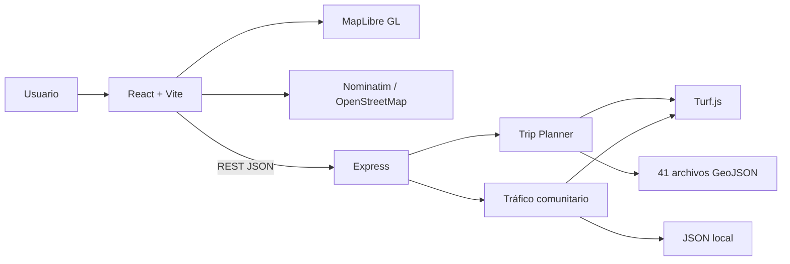
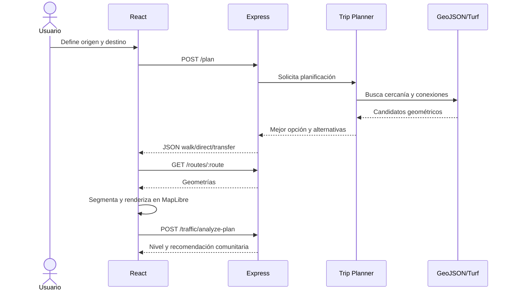

# BUSNET

## Plataforma Inteligente para la Movilidad Urbana en El Salvador

**Proyecto para Competencia Tecnológica**
**Reporte técnico del estado actual del producto**
**Fecha de generación:** 5 de julio de 2026
**Equipo identificado en el repositorio:** Cristian, Frank, Alexander y Eduardo

> **Estado verificado:** aplicación web funcional con planificador multimodal basado en geometría, 41 archivos GeoJSON, tráfico colaborativo, visualización MapLibre y 36 pruebas backend aprobadas.

---

## Índice

1. [Resumen ejecutivo](#1-resumen-ejecutivo)
2. [Problemática](#2-problemática)
3. [Objetivos](#3-objetivos)
4. [Arquitectura](#4-arquitectura)
5. [Funcionalidades implementadas](#5-funcionalidades-implementadas)
6. [Motor de planificación](#6-motor-de-planificación)
7. [Experiencia de usuario](#7-experiencia-de-usuario)
8. [Reportes comunitarios](#8-módulo-de-reportes-comunitarios)
9. [Tecnologías](#9-tecnologías)
10. [Estructura del proyecto](#10-estructura-del-proyecto)
11. [Algoritmos](#11-algoritmos)
12. [Seguridad](#12-seguridad)
13. [Escalabilidad](#13-escalabilidad)
14. [Casos de uso](#14-casos-de-uso)
15. [Flujo de funcionamiento](#15-flujo-de-funcionamiento)
16. [Diferenciadores](#16-diferenciadores)
17. [Limitaciones actuales](#17-limitaciones-actuales)
18. [Trabajo futuro](#18-trabajo-futuro)
19. [Conclusiones](#19-conclusiones)

---

# 1. Resumen ejecutivo

BUSNET es una aplicación web de movilidad que ayuda a encontrar combinaciones de rutas de autobús entre un origen y un destino en El Salvador. El producto utiliza recorridos reales almacenados como GeoJSON y cálculo geoespacial con Turf.js para identificar cercanía, conexiones y sentido de circulación.

La solución permite recomendar caminar cuando el destino está próximo, utilizar una ruta directa o combinar hasta tres buses. Presenta alternativas, distancia caminando estimada, puntos aproximados de abordaje, descenso y transbordo, y muestra el recorrido sobre un mapa interactivo.

BUSNET atiende principalmente a personas usuarias del transporte colectivo que no conocen todas las rutas disponibles, necesitan realizar transbordos o desean comparar opciones antes de viajar. También incorpora reportes comunitarios sobre tráfico e incidentes para advertir afectaciones cercanas.

> **Propuesta de valor actual:** convertir trazados cartográficos dispersos en recomendaciones comprensibles, visuales y adaptadas al transporte salvadoreño.

# 2. Problemática

El transporte público salvadoreño depende en gran medida del conocimiento informal. Una persona puede conocer las rutas de su zona, pero no las conexiones necesarias para llegar a un destino nuevo. Esto provoca:

- incertidumbre al combinar rutas;
- caminatas innecesarias;
- pérdida de tiempo buscando puntos de conexión;
- dependencia de recomendaciones verbales;
- dificultad para visitantes y usuarios ocasionales;
- poca visibilidad sobre incidentes recientes;
- ausencia de una experiencia digital unificada para recorridos locales.

BUSNET no afirma resolver horarios o ubicación en tiempo real. Su alcance actual se concentra en aprovechar geometrías de recorridos disponibles para orientar decisiones de viaje.

# 3. Objetivos

## Objetivo general

Proporcionar una plataforma web que facilite la planificación y visualización de viajes en transporte público mediante información geográfica local.

## Objetivos específicos

- localizar rutas próximas al origen y al destino;
- recomendar caminata, ruta directa o viaje con transbordos;
- respetar el orden y sentido estimado de los recorridos;
- mostrar alternativas ordenadas y comprensibles;
- representar gráficamente los tramos útiles y no utilizados;
- permitir explorar manualmente las rutas disponibles;
- incorporar reportes comunitarios temporales;
- mantener una experiencia usable en temas claro, oscuro y del sistema.

# 4. Arquitectura

BUSNET usa una arquitectura cliente-servidor sencilla, adecuada para una demostración competitiva.



## Frontend

React administra el estado de búsqueda, origen, destino, viaje seleccionado, reportes, preferencias visuales y errores. MapLibre renderiza el mapa, las rutas, flechas, marcadores y zonas comunitarias. Turf.js también se usa en frontend para proyectar y cortar el tramo útil de cada recorrido.

## Backend

Express expone endpoints REST. Al iniciar, carga los GeoJSON, extrae metadata y normaliza sus geometrías una sola vez. El planificador trabaja con esa estructura en memoria y aplica cachés para conexiones geométricas.

## Datos geográficos

Los recorridos están almacenados en `backend/geojson`. El normalizador acepta `LineString`, `MultiLineString` y `GeometryCollection`, conserva metadata y produce líneas utilizables por el motor.

## Servicios y componentes principales

| Capa | Elementos reales |
|---|---|
| API | `/routes`, `/routes/:route`, `/search`, `/plan`, `/traffic/*`, `/trip/start` |
| Servicios backend | `routePlanner`, `geojsonNormalizer`, `communityTrafficService`, `planRequestValidator` |
| Componentes frontend | `MapView`, `RouteControlPanel`, `TripOptions`, `TrafficPanel`, `TrafficReportForm`, `ThemeToggle` |
| Hooks | geolocalización, tema y preferencia de animaciones |
| Utilidades | colores, animación cartográfica, estilos por sentido y segmentación |

# 5. Funcionalidades implementadas

## Planificación y búsqueda

| Funcionalidad | Funcionamiento | Archivos principales | Beneficio |
|---|---|---|---|
| Buscador de lugares | Consulta Nominatim, limitado a El Salvador | `api.js`, `Home.jsx` | Permite localizar destinos conocidos |
| Geolocalización | Solicita GPS mediante API del navegador | `useLocation.jsx` | Usa la posición actual como origen |
| Selección en mapa | El siguiente clic asigna origen, destino o reporte | `Home.jsx`, `MapView.jsx` | Alternativa cuando GPS o búsqueda no bastan |
| Exploración manual | Lista rutas y carga su GeoJSON | `/routes`, `/routes/:route`, `RouteControlPanel` | Permite inspeccionar un recorrido completo |
| Trip Planner | Envía origen y destino a `POST /plan` | `Home.jsx`, `api.js`, `routePlanner.js` | Automatiza la selección de buses |
| Caminata | Recomienda caminar si el destino está a 200 m o menos | `routePlanner.js` | Evita sugerir buses innecesarios |
| Ruta directa | Detecta la misma ruta en ambos extremos | `routePlanner.js` | Reduce transbordos |
| Hasta tres buses | Busca viajes con máximo dos transbordos | `routing.js`, `routePlanner.js` | Amplía la cobertura de conexiones |
| Cuatro opciones | Retorna una recomendada y hasta tres alternativas | `routePlanner.js`, `TripOptions.jsx` | Permite comparar |
| Sentido ida/regreso | Evalúa el orden de abordaje y descenso sobre la línea | normalizador y planificador | Reduce recomendaciones en sentido incorrecto |

## Visualización

- MapLibre con límites de navegación de El Salvador.
- Estilo Liberty en modo claro y Dark en modo oscuro.
- Cambio de estilo sin perder capas personalizadas.
- Diferenciación de ida y regreso mediante variaciones del color base.
- Flechas de dirección sobre las líneas.
- Corte limpio del tramo útil con Turf.js.
- Tramo útil a opacidad completa y secciones no utilizadas al 30%.
- Marcadores diferenciados para origen, destino, abordaje, llegada y transbordos.
- Limpieza centralizada de marcadores, capas, fuentes, listeners y popups temporales.
- Ajuste automático del mapa al recorrido manual completo.
- Hover y etiqueta del nombre de ruta.
- Animaciones configurables y preferencia persistente.

## Interfaz

- Panel compacto con estilo glass y diseño responsive.
- Tema claro, oscuro y sistema, persistido en almacenamiento local.
- Botón para comprimir el panel después del cálculo.
- Alternativas expandibles sin perder marcadores al pulsar nuevamente.
- Estados de carga, validación y error.
- Panel comunitario plegable y filtros por severidad.

## Calidad verificada

> **Backend:** 36 de 36 pruebas aprobadas el 5 de julio de 2026.
> **Frontend:** ESLint aprobado y build de producción Vite completado.
> **Observación:** Vite advierte que el bundle principal supera 500 kB; no impide la compilación.

# 6. Motor de planificación

## Búsqueda progresiva

Origen y destino se convierten en puntos Turf. Cada punto se proyecta sobre las rutas usando `nearestPointOnLine`. El radio empieza en 100 m y se expande en pasos de 100 m hasta encontrar cobertura o alcanzar 5,000 m.

El motor limita los candidatos a ocho rutas para cada extremo. Si el destino está dentro del umbral de 200 m, retorna una opción `walk`.

## Rutas directas

Cuando una misma ruta cubre origen y destino, el motor compara sus líneas. Verifica que el punto de abordaje aparezca antes que el descenso en el sentido de coordenadas. Las opciones con sentido válido reciben mayor confianza.

## Conexiones y transbordos

Para rutas distintas, Turf.js busca intersecciones y proximidad entre líneas. Una conexión puede surgir de:

- una intersección geométrica;
- los puntos más cercanos entre dos líneas;
- una caminata de transferencia de hasta 200 m.

BUSNET permite actualmente dos transbordos, equivalentes a un máximo de tres buses. Evita ciclos y rutas repetidas.

## Rendimiento

- normalización única al iniciar;
- caché en memoria de conexiones por par de rutas;
- caché de líneas y límites geográficos;
- máximo de 5,000 estados de búsqueda;
- máximo de 64 opciones generadas;
- máximo de cuatro conexiones candidatas por pareja;
- validaciones de dirección concentradas en candidatos;
- retorno temprano cuando existe una directa conveniente.

## Ranking

El orden considera confianza del sentido, tipo de viaje, caminata total, cantidad de buses y transbordos, radios utilizados, distancia estimada en bus y nombre de ruta como desempate. Las opciones duplicadas se eliminan antes de responder.

# 7. Experiencia de usuario

La interfaz prioriza el mapa y mantiene controles compactos. El panel principal utiliza fondo semitransparente, blur moderado, bordes suaves y jerarquía tipográfica. Después de calcular, puede comprimirse para observar el recorrido.

Los colores de ruta se conservan, pero ida y regreso se distinguen mediante tonos relacionados. Los tramos no utilizados pierden opacidad y grosor sin degradados, mientras el recorrido relevante permanece destacado.

Las animaciones incluyen aparición de marcadores, revelado de líneas, movimientos de cámara y transiciones de panel. Pueden desactivarse y se respeta `prefers-reduced-motion`.

La aplicación incluye accesibilidad básica mediante etiquetas, títulos, estados ARIA y controles de teclado. Todavía requiere una auditoría formal de contraste y navegación completa.

# 8. Módulo de reportes comunitarios

BUSNET permite registrar tráfico, accidentes, calles cerradas, inundaciones, buses detenidos, controles policiales y otros incidentes. Cada reporte incluye severidad, descripción, coordenadas, radio, fecha de creación y expiración automática de dos horas.

Los reportes se almacenan en `backend/data/community-traffic.json`. El backend filtra los expirados al listar. El mapa muestra zonas verdes, amarillas o rojas y marcadores con información temporal.

`POST /traffic/analyze-plan` compara la opción de viaje con los reportes activos usando Turf.js. El frontend presenta un nivel de afectación y puede sugerir una alternativa menos afectada, sin cambiar automáticamente la decisión del usuario.

> Los datos se presentan siempre como **tráfico reportado por la comunidad**, no como información oficial.

# 9. Tecnologías

| Tecnología | Versión declarada | Uso | Beneficio |
|---|---:|---|---|
| React | 19.2.7 | Interfaz y estado | Componentes y respuesta interactiva |
| React DOM | 19.2.7 | Render web | Integración con navegador |
| Vite | 8.1.1 | Desarrollo y build | Ciclo rápido y empaquetado |
| MapLibre GL | 5.24.0 | Cartografía | Mapa vectorial libre |
| Turf.js | 7.3.5 | GIS backend y frontend | Distancias, proyecciones, cortes e intersecciones |
| Express | 5.2.1 | API REST | Backend ligero |
| Node.js | No fijada | Ejecución backend | Ecosistema JavaScript unificado |
| Nominatim | Servicio externo | Geocodificación | Búsqueda de lugares en El Salvador |
| Fuse.js | 7.4.2 | Dependencia frontend | Búsqueda difusa disponible; uso actual no identificado |
| ESLint | 10.6.0 | Calidad frontend | Detección de problemas |
| Node Test Runner | Incluido en Node | Pruebas backend | Sin framework adicional |

# 10. Estructura del proyecto

```text
busnet/
├── backend/
│   ├── config/             # Parámetros de rutas y tráfico comunitario
│   ├── data/               # Persistencia JSON local
│   ├── geojson/            # 41 recorridos
│   ├── services/           # Planificación, validación y análisis GIS
│   ├── tests/              # 36 pruebas automatizadas
│   └── index.js            # Express, carga de datos y endpoints
├── frontend/
│   ├── public/             # Favicon e iconos
│   ├── src/
│   │   ├── components/     # Mapa, viaje, tráfico y UI
│   │   ├── hooks/          # GPS, tema y animaciones
│   │   ├── pages/          # Composición principal
│   │   ├── services/       # Cliente HTTP
│   │   └── utils/          # GIS visual, colores y animaciones
│   └── vite.config.js
└── docs/                   # Plan maestro y documentación técnica
```

# 11. Algoritmos

## Trip Planner

El motor no utiliza un grafo vial formal ni Dijkstra. Implementa una búsqueda acotada sobre rutas candidatas y conexiones geométricas cacheadas. Explora rutas directas, un transbordo y dos transbordos.

## Turf.js

`nearestPointOnLine` mide acceso, descenso y posición relativa. `lineIntersect` detecta cruces. Las distancias estiman caminata y proximidad. En frontend, `lineSlice` separa segmentos antes, durante y después del trayecto útil.

## Control de explosión combinatoria

La búsqueda limita candidatos, conexiones, opciones, estados y profundidad. Además, elimina ciclos y deduplica alternativas.

## Renderizado

Las geometrías se normalizan como colecciones de líneas con propiedades visuales. MapLibre crea sources y layers separados para ruta y flechas. Los marcadores HTML se administran mediante referencias y cleanup.

# 12. Seguridad

Buenas prácticas observadas:

- validación de coordenadas y tipos de reporte;
- límite de longitud de descripción;
- API keys externas no integradas ni expuestas;
- automatizaciones de voz solo documentadas;
- expiración de reportes;
- escape natural de texto mediante renderizado React;
- separación del proveedor de mapas y lógica backend;
- respuestas HTTP 400, 404 y 500 controladas.

Pendientes de seguridad:

- CORS está abierto globalmente;
- no existe autenticación ni autorización;
- no hay rate limiting;
- los reportes no tienen moderación ni identidad;
- la persistencia JSON puede sufrir escrituras concurrentes;
- la URL del backend está fija en frontend;
- no hay validación de esquema con una librería especializada;
- `/trip/start` es una simulación y registra datos en consola.

# 13. Escalabilidad

La separación entre frontend, API, servicios GIS y datos permite evolucionar por etapas:

1. migrar reportes de JSON a PostgreSQL/PostGIS;
2. almacenar rutas en un catálogo versionado;
3. precalcular y persistir el grafo de conexiones;
4. usar índices espaciales;
5. parametrizar la URL de API;
6. incorporar caché distribuida;
7. desplegar frontend y backend por separado;
8. introducir paradas, horarios y GTFS validados.

# 14. Casos de uso

## Usuario frecuente

Selecciona su ubicación, busca un destino y compara rutas directas o combinadas.

## Ciudadano que reporta

Registra un incidente aproximado y contribuye a advertir a otros usuarios.

## Visitante

Explora rutas desconocidas y recibe referencias visuales sin depender de conocimiento local.

## Motorista u operador

**En desarrollo.** No existe actualmente una interfaz operativa, autenticación de motorista ni dashboard Fleet.

# 15. Flujo de funcionamiento



# 16. Diferenciadores

- enfoque específico en rutas salvadoreñas;
- funcionamiento sobre GeoJSON local, sin depender de una API propietaria de rutas;
- planificación hasta tres buses;
- sentido ida/regreso y confianza direccional;
- reportes comunitarios integrados al análisis;
- transparencia al llamar “aproximados” a abordajes y transbordos;
- temas visuales y presentación cartográfica lista para demostración;
- arquitectura simple, auditable y ejecutable localmente.

# 17. Limitaciones actuales

- No existen paradas oficiales.
- Los puntos de abordaje, descenso y transbordo son aproximaciones geométricas.
- No todos los GeoJSON contienen sentido confirmado.
- No hay horarios, frecuencias, ocupación ni GPS en tiempo real.
- Tiempo y costo mostrados en frontend son estimaciones simples, no datos operativos validados.
- El radio máximo de 5 km puede producir recomendaciones con caminata considerable.
- El motor soporta como máximo tres buses.
- La búsqueda de lugares depende directamente de Nominatim desde el navegador.
- Los reportes se guardan en un archivo JSON local.
- No hay cuentas, moderación, base de datos ni despliegue documentado.
- El bundle frontend supera el umbral recomendado de 500 kB.
- Los documentos antiguos contienen cifras y objetivos que ya no representan exactamente el código.

# 18. Trabajo futuro

## Documentado, no implementado

- proveedor de tráfico con cobertura validada para El Salvador;
- webhook de n8n;
- síntesis de voz con ElevenLabs;
- alertas de voz con consentimiento y deduplicación;
- Google Maps Traffic, sujeto a cobertura, licencia y costo;
- BusNET Fleet y checking digital;
- tracking de buses con GPS real o simulación explícita;
- base de datos y paneles empresariales;
- inteligencia artificial para instrucciones o predicción;
- GTFS, paradas y horarios validados.

> TomTom fue descartado y no forma parte del código actual. n8n y ElevenLabs solo cuentan con documentación de arquitectura y payload.

# 19. Conclusiones

BUSNET presenta un núcleo competitivo real: un planificador geoespacial funcional, una interfaz cartográfica moderna y una capa comunitaria integrada. La solución demuestra capacidad técnica mediante normalización GeoJSON, conexiones Turf.js, control de sentido, límites de búsqueda, cachés y pruebas automatizadas.

Ante un jurado, el proyecto debe presentarse como un **MVP funcional de orientación geométrica**, no como un sistema oficial de transporte en tiempo real. Su fortaleza está en transformar datos locales en una experiencia útil y extensible. La evolución prioritaria debe ser validar paradas, sentidos, horarios y operación real antes de prometer predicciones o tracking.

---

## Anexo A. Endpoints verificados

| Método | Endpoint | Estado |
|---|---|---|
| GET | `/routes` | Implementado |
| GET | `/routes/:route` | Implementado |
| GET | `/search?q=` | Implementado |
| POST | `/plan` | Implementado |
| GET | `/traffic/community` | Implementado |
| POST | `/traffic/report` | Implementado |
| POST | `/traffic/analyze-plan` | Implementado |
| POST | `/trip/start` | Simulación |

## Anexo B. Evidencia de calidad

- 41 archivos `.geojson`.
- 36 pruebas backend aprobadas.
- ESLint frontend aprobado.
- Build Vite aprobado.
- Pruebas cubren caminata, directas, radio, sentido, geometrías complejas, transbordos, duplicados, ciclos, límites, UES–Tonacatepeque y tráfico comunitario.
